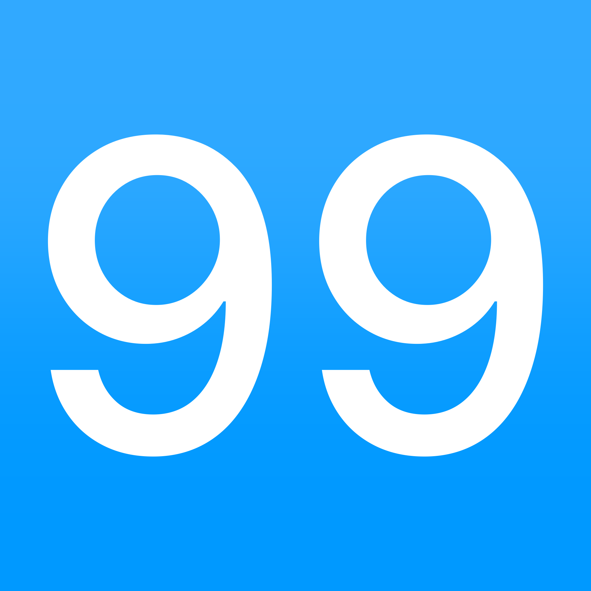

# Floor Signs

## 🚀 Live Demo

**➡️ [Click here for a live demo of the Floor Sign Generator](https://your-github-username.github.io/floor-signs/)** ⬅️


This repository contains a collection of high-resolution, ready-to-use floor signs and a powerful web-based generator to create your own.

 <p align="center"></p>

## ✨ Features

*   **High Resolution:** 1920x1920 resolution, very high quality.
*   **Comprehensive Set:** Includes numbers from -9 to 99, plus letters for "Lobby" (L) and "Parking" (P).
*   **Optically Centered:** Font sizes are dynamically adjusted based on character width to ensure each sign feels visually balanced.

## 🎨 Available Styles

This project is organized by style. Currently, one style is available.

| Style Name          | Font Color      | Background Gradient                                                                                             | Font Weight | Font Family |
| ------------------- | --------------- | --------------------------------------------------------------------------------------------------------------- | ----------- | ----------- |
| `blue-med` | White `#FFFFFF` | **From:** `RGB(49, 169, 255)` / `#31A9FF` (Top)<br/>**To:** `RGB(0, 153, 255)` / `#0099FF` (Bottom)                                                        | 500 (Medium)| Inter |

## ⚙️ How to Use

You can use these signs in your project in two ways:

1.  **Clone the repository:**
    ```bash
    git clone https://github.com/nmknm/floor-signs.git
    ```

2.  **Download a ZIP:**
    Click the "Code" button on the GitHub repository page and select "Download ZIP".

## 🛠️ Technical Specifications

*   **Resolution:** `1920x1920` pixels
*   **File Format:** `PNG`.
*   **Included Signs:**
    *   **Numbers:** -9 through 99.
    *   **Letters:** L (Lobby), P (Parking).
*   **Font Sizing Logic:**
    To ensure visual consistency, the font size is adjusted based on the width of the character(s). Wider characters (like `99` or `50`) use a slightly smaller font size than narrow characters (like `1` or `11`) to appear perfectly centered and balanced within the frame.
    *   **Narrow Characters** (e.g., `1`, `7`, `L`, `P`): 2800px
    *   **Wide Characters** (e.g., `-9`, `41`): 2400px
    *   **Extra-Wide Characters** (e.g., `99`, `50`): 2000px

## 🚀 Publishing to GitHub Pages

This repository includes a web-based sign generator (`index.html`). To publish it as a live website using GitHub Pages:

1.  **Navigate to Settings:** In your repository on GitHub, go to the **Settings** tab.
2.  **Go to Pages:** In the left sidebar, click on **Pages**.
3.  **Configure the Source:**
    *   Under "Build and deployment", for the "Source", select **Deploy from a branch**.
    *   For the "Branch", select your main branch (`main` or `master`) and the ` / (root)` folder.
4.  **Save:** Click **Save**.

After a minute or two, GitHub will build and deploy your site. The public URL will be displayed at the top of the "Pages" settings page.

## 📄 License

This project is licensed under the MIT License. See the [LICENSE](LICENSE) file for details. You are free to use, modify, and distribute these assets in personal and commercial projects.

## 🤝 Contributing

Contributions, issues, and feature requests are welcome!

## Future Plans

* More customizability: Add more color options, fonts and font weights.
* More numbers and letters.
* A website for making custom sign sets.
* More file formats.
